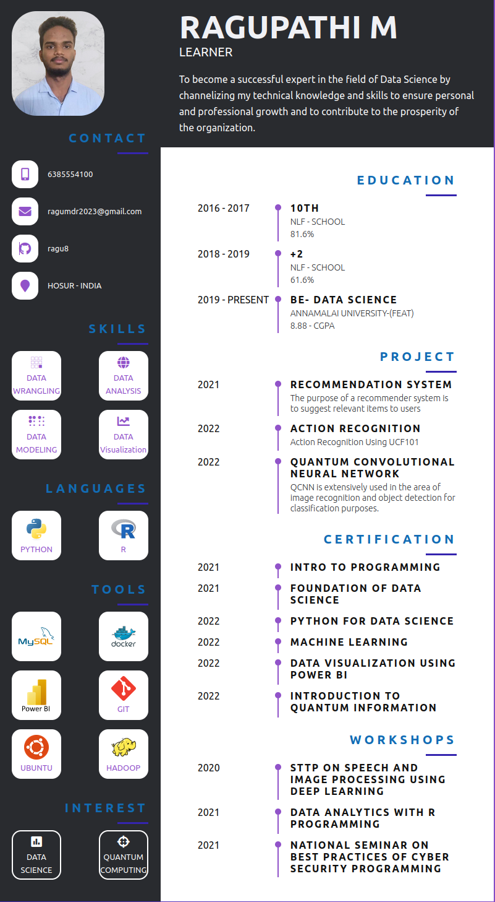

  

<h1 align="center">
  
</h1>

 <h1 align="center">   </h1>  
 

## 🏆 GitHub Trophies

## ⚡ Technologies

<h3 align="left"></h3>

                               

  
  
  
  

  
 

  <a href="https://github.com/ragu8">
  
  

  
 

 
  
  
