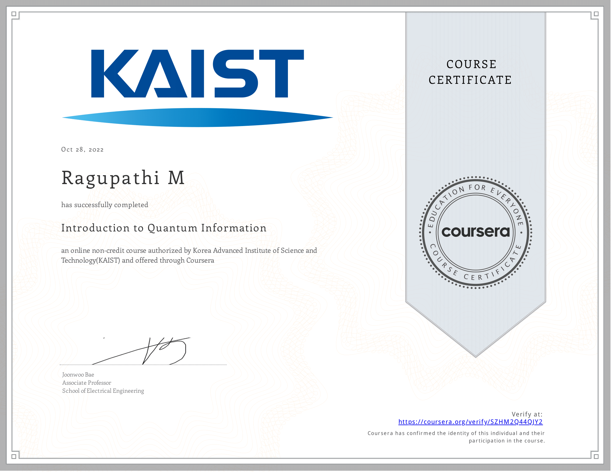

  

<h1 align="center">
  
</h1>

 

<h3>An enthusiastic Data Analyst based in Hosur 🇮🇳, with a strong passion for uncovering meaningful insights through the application of data science techniques.</h3>

- 🔭 Functioning as a Data Analyst for  <a href="https://galaxytechnologyservices.net/" target="blank">Galaxy Technology Services,</a> Singapore.

- 🌱 I’m currently Learning <a href="https://en.wikipedia.org/wiki/Operations_research" target="blank">Operational Research</a>

- 📝 I regularly write articles on [Medium.](https://medium.com/@Ragu8)

- 💬 Query me on **Data Science** & **Operations Research**.
- 📫 Preferred method of contact **ragu@galaxytechnologyservices.net**

<h3 align="left" > Connect with me 🤝 </h3>

 

        
        
		

	

  

	
<table><tr><td valign="top" width="25%">

## Languages 

  
  
	

</td><td valign="top" width="25%">

## Databases  

  
  
	
 
	

  
	
  

 

</td><td valign="top" width="25%">

## ML & DL

  
  
  
  

</td>
<td valign="top" width="25%">

## DevOps  

  

  
  
  

</td>
	
	
	
<td valign="top" width="25%">
	
	
## Bigdata 
	

 	
	 
	

	
	
<td valign="top" width="25%">
	
	
## Image processing
	

 	
	
	

	
	
	
	
	
</td></tr></table> 

 

  
 
	
<table>
	<tr><td valign="top" width="33%">
 

  
	
	
Data Science Foundation
 

	
Introduction to Quantum Information
 
	

 

</td>
<td valign="top" width="33%">

  
	
	

	
Python for Data Science

	

	
Data Analytics with R

</td>
<td valign="top" width="33%">

  

	
Deep Learning

	

	
Data Visualization
 

</td>

</tr></table> 
	

  
 
 

	
	 

	
 

	

  

	

	
 

	

	
  

 

	<a href="https://github.com/piyushsuthar/github-readme-quotes"> 
	

  

